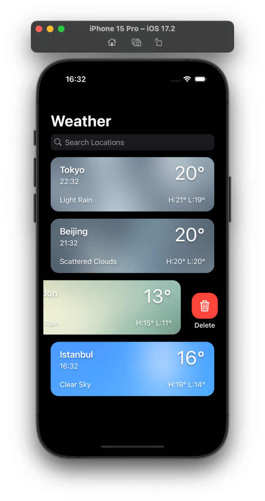
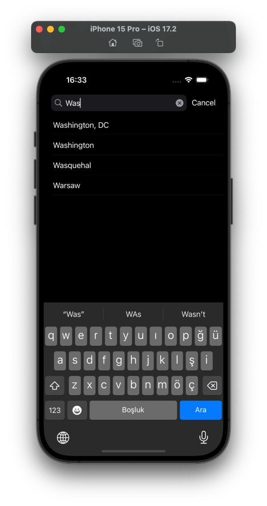
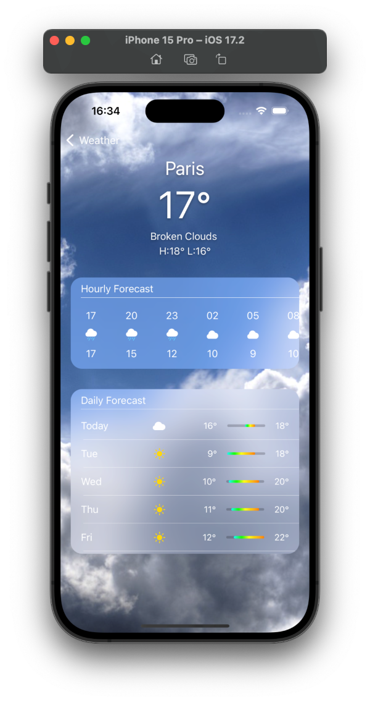

# Weather App

Weather is an iOS application for instantly checking current weather conditions and forecasts for any location you desire. Weather delivers accurate and up-to-date weather data along with a user-friendly interface.

## Screenshots

## Features

- **Current Weather and Forecasts:** Access real-time weather information including temperature, weather description, local time, and daily/hourly forecasts for any location worldwide.
- **OpenWeatherMap API Integration:** Utilizes the OpenWeatherMap API to gather current and forecasted weather data, ensuring reliability and precision.
- **Location Search:** Easily find and add locations using the integrated search bar. The app utilizes MKSearch to retrieve location names and coordinates based on user input.
- **Home Screen:** Added locations are displayed on the home screen as tiles, each showcasing the current weather temperature, location name, local time, weather description, highest, and lowest temperatures.
- **Detailed Weather Information:** Tap on a location tile to delve deeper into its weather forecast. View hourly forecasts, a 5-day outlook with high and low temperatures, and weather descriptions accompanied by weather icons.
- **Dynamic Backgrounds:** Each location's tile features a custom image background that dynamically changes based on the local time (day or night) of that location.
- **Persistent Storage with Core Data:** The app utilizes Core Data to save added locations. This means that once a location is added, it is stored locally, allowing users to access their preferred locations without the need to add them repeatedly. Users can remove stored locations any time they want from the Home Screen.

## How to Use

1. **Add Locations:** Use the search bar in the navigation bar to find and add locations of interest.
2. **View Weather Data:** Instantly see current weather details on each added location's tile, including temperature, local time, and weather description.
3. **Access Detailed Forecasts:** Tap on a location tile to access detailed forecasts. View hourly forecasts for the upcoming hours and a 5-day forecast with high and low temperatures.
